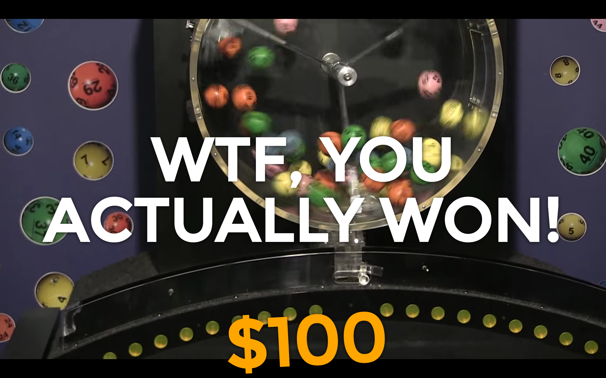
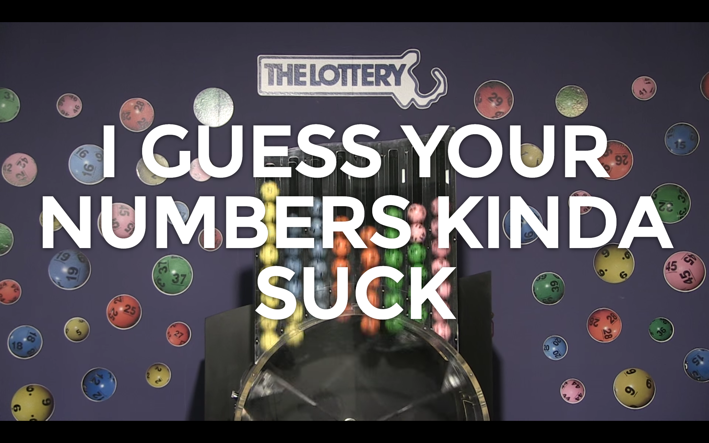

# Megabucks Doubler
A simple one-page app that validates the winner or loser status of a user's Megabucks Doubler number against the current week's drawing.

## Problem
I received a strange gift of a year-long subscription to the Massachusetts Megabucks Doubler - A little piece of paper with numbers written on it that I  needed to check each week to figure out if I won or lost. As trivial as this task was, it was a weekly pain in the ass to go to the [horribly designed Megabucks site](http://www.masslottery.com/games/lottery/megabucks-doubler.html) to look up the numbers. Most weeks I didn't bother as the experience was annoying.

## Solution
A simple one-page app that would scrape the weekly numbers and drawings video from the Megabucks site and check whether I won or lost (against currently hard-coded numbers). If I won, it would calculate and display winnings. If I lost, it would tell me so, while overlayed onto a full screen video of the drawing. This solution would provide a more entertaining experience and would allow a much simpler way for me to check my weekly numbers. 

## Next Feature
I'll add the ability for a user to submit their own numbers and save them into the browser cookies for future site visits.

## Screenshots

